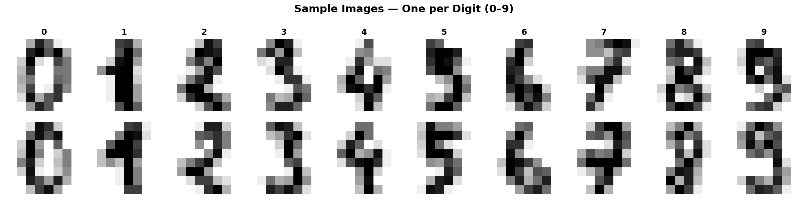
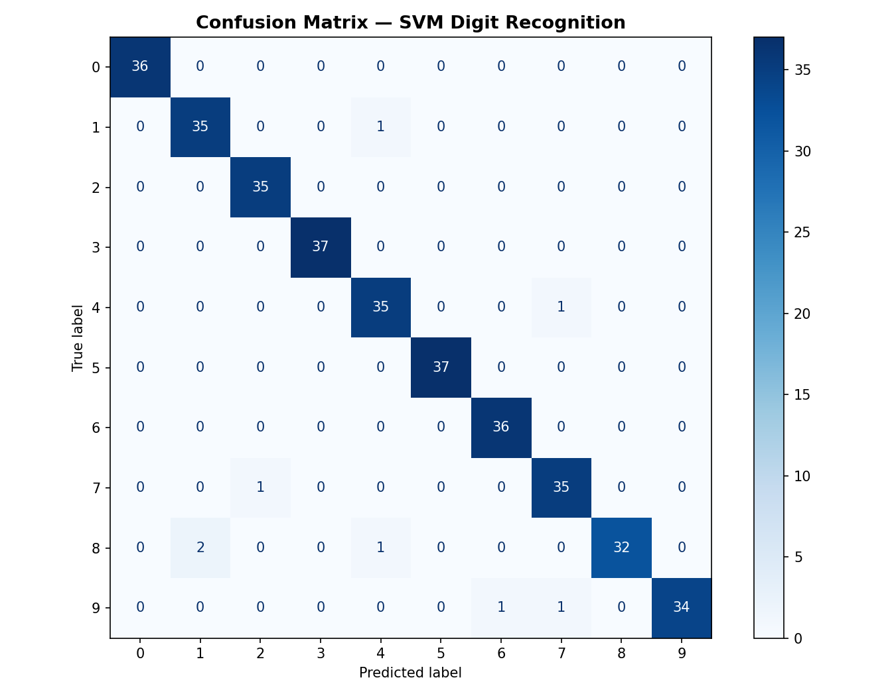
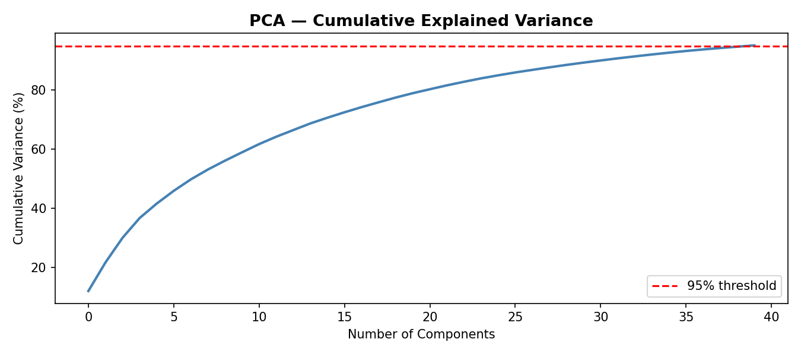
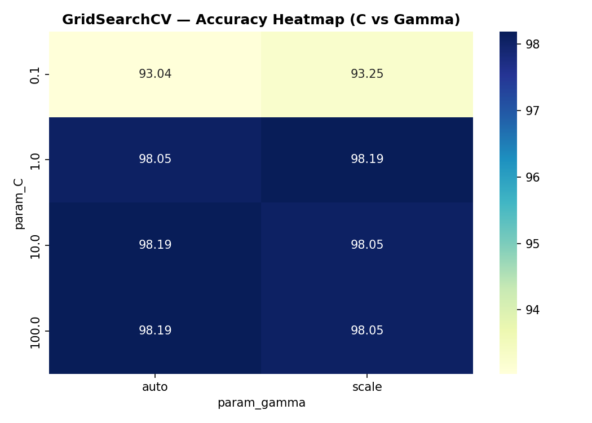

# 🔢 Handwritten Digit Recognition using SVM


An end-to-end Machine Learning project that classifies handwritten digits (0–9) using a **Support Vector Machine (SVM)** with an RBF kernel. Includes full EDA, PCA dimensionality reduction, hyperparameter tuning via GridSearchCV, and an interactive Streamlit web app.

---

## 🚀 Live Demo

> Run locally using the steps below.

---

## 📊 Results

| Metric         | Value   |
|----------------|---------|
| Test Accuracy  | 97.78%  |
| CV Accuracy    | 98.19%  |
| Best Kernel    | RBF     |
| Best C         | 1       |
| Best Gamma     | scale   |
| PCA Components | 40      |

---

## 📁 Project Structure

```
digit-recognition-svm/
│
├── notebook/
│   └── digit_recognition.py     # Full ML pipeline
│
├── model/
│   ├── svm_model.pkl            # Trained SVM model
│   ├── scaler.pkl               # StandardScaler
│   ├── pca.pkl                  # PCA transformer
│   ├── class_distribution.png
│   ├── sample_images.png
│   ├── pca_variance.png
│   ├── confusion_matrix.png
│   ├── gridsearch_heatmap.png
│   └── misclassified.png
│
├── app.py                       # Streamlit web app
├── requirements.txt
└── README.md
```

---

## ⚙️ ML Pipeline

```
Raw Data (8x8 pixels)
       ↓
Train-Test Split (80/20, stratified)
       ↓
Standard Scaling (zero mean, unit variance)
       ↓
PCA (40 components, 95% variance retained)
       ↓
GridSearchCV (C, gamma tuning, 5-fold CV)
       ↓
SVM with RBF Kernel
       ↓
Evaluation (Accuracy, Confusion Matrix, Report)
```

---

## 🛠️ Installation & Usage

### 1. Clone the repo
```bash
git clone https://github.com/YOUR_USERNAME/digit-recognition-svm.git
cd digit-recognition-svm
```

### 2. Install dependencies
```bash
pip install -r requirements.txt
```

### 3. Run the ML pipeline
```bash
cd notebook
python digit_recognition.py
```

### 4. Launch the Streamlit app
```bash
streamlit run app.py
```

---

## 📈 Key Visualizations

### Sample Digit Images


### Confusion Matrix


### PCA Explained Variance


### GridSearch Heatmap


---

## 🧠 What I Learned

- How SVM finds the optimal decision boundary (hyperplane) with maximum margin
- The role of the **RBF Kernel** in handling non-linearly separable data
- How **PCA** reduces noise and speeds up training while preserving 95% variance
- Hyperparameter tuning using **GridSearchCV** with cross-validation
- Building an interactive **Streamlit** app for model deployment

---

## 🗂️ Dataset

- **Source**: `sklearn.datasets.load_digits`
- **Samples**: 1,797
- **Features**: 64 (8×8 pixel images, grayscale)
- **Classes**: 10 (digits 0–9)

---

## 📬 Contact

Made by Nashrah K(https://github.com/nashrahjaan53-code)

⭐ Star this repo if you found it helpful!